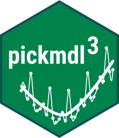

# R package pickmdl3   


| [Her kjeme noko om CRAN](https://cran.r-project.org/package=GaussSuppression) |  | [pkgdown website](https://statisticsnorway.github.io/ssb-pickmdl3/) |  | [GitHub Repository](https://github.com/statisticsnorway/ssb-pickmdl3) |
|----------------------|---|----------------------|---|----------------------|


***

## R package implementing the X-12-ARIMA pickmdl procedure within rjd3 

A package that makes the pickdml model selection procedure in X-12-ARIMA available in rjd3. The pickmdl model selection procedure
restricts the choiche of seasonal RegARIMA model to an ordered set of five parsimonius models. The package relies on the R packages 
[rjd3toolkit](https://CRAN.R-project.org/package=rjd3toolkit) and [rjd3x13](https://CRAN.R-project.org/package=rjd3x13) and enables the x13 function in rjd3x13
to be run with the pickmdl specification as well as the usual automdodel specification. The package further includes functionality for seasonal adjustment of multiple series based on a data frame with model specifications. 


***

📌 See the [broader list of available functions](https://statisticsnorway.github.io/ssb-pickmdl3/reference/index.html).


***

See the package vignettes: 
[Magnitude table suppression](https://cran.r-project.org/web/packages/GaussSuppression/vignettes/Magnitude_table_suppression.html), 
[Small count frequency table suppression](https://cran.r-project.org/web/packages/GaussSuppression/vignettes/Small_count_frequency_table_suppression.html), 
[Defining tables for GaussSuppression](https://cran.r-project.org/web/packages/GaussSuppression/vignettes/define_tables.html).


***

## Installation

Since *pickmdl3* depends on *rjd3toolkit* and *rjd3x13*, refer to the installation instruction found on the  
[rjdverse](https://github.com/rjdverse) GitHub page. See also the chapter on R packages in the 
[Jdemetra+ documentation](https://doc.jdemetra.org/t-r-packages).

Usual installation from GitHub:
```r
# install.packages("devtools")
devtools::install_github("statisticsnorway/ssb-pickmdl3")
```
If you know that the dependencies listed under *Imports* and *Depends* in the 
[DESCRIPTION file](https://github.com/statisticsnorway/ssb-pickmdl/blob/main/DESCRIPTION)
are already installed, an alternative is:
```r
devtools::install_github("statisticsnorway/pickmdl", dependencies = FALSE)
```


*
***
