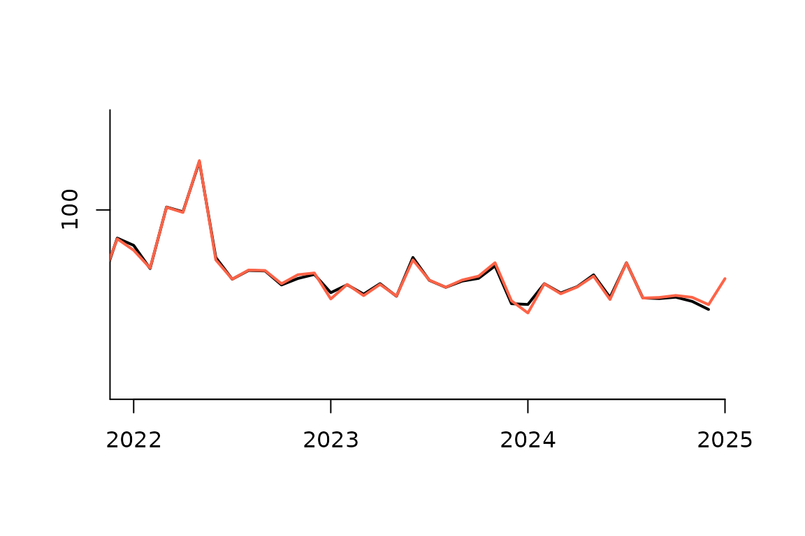

# What is pickmodel?

Pre-adjustment and forecasting with a sARIMA model is of central
importance to the x13-metholdogy, as calendar effects and effects of
outliers need to be taken into account before seasonal components and
trend can be calculated with filter based methods of x13. In Jdemetra
and rjd3, the automatic procedure for selecting an sARIMA model is the
automodel procedure. The pickmdl approach differs from the automodel
procedure by restricting the model choiche to an ordered list of five
parsimonious models. The pickmdl selection procedure selects the first
model on this list that fulfills three pre-defined criteria.

The sARIMA models on the pickmdl list are:
``` math
\begin{aligned}
(0,1,1)(0,1,1)_s  \\
(0,1,2)(0,1,1)_s \\
(2,1,0)(0,1,1)_s \\
(0,2,2)(0,1,1)_s \\
(2,1,2)(0,1,1)_s
\end{aligned}
```
The pickmdl selection criteria are:

1.  The absolute average percentage error of the extrapolated values
    within the last three years of data is less than 15 percent
2.  The p-value associated with the fitted model’s Ljung-Box Q-statistic
    test of the lack of correlation in the model’s residuals must be
    greater than 5 percent
3.  There are no signs of overdifferencing. There is an indication of
    overdifferencing if the sum of the non-seasonal MA parameter
    estimates (for models with at least one non-seasonal difference) is
    greater than 0.9.

## Why use pickmdl?

The pickmdl approach prioritizes model stability. By restricting the
model choiche to an ordered list of five models, the selected model may
not be the model with the optimal fit, but as it satisfies the selection
criteria it should be of acceptable quality. This may lead to less
future revisions of seasonally adjusted data, as the same model tends to
be selected in the future if it still passes the criteria. The search
for the model with the optimal fit, on the other hand, may lead to model
change even though there is only a small difference in quality, with
unnecessary revisions as a consequence.

Let us illustrate this point with an example. We use the Norwegian
retail index for nace 47.6 . Following the best practice defined in ESS
Guideluines on seasonal adjustment, model identification should be done
once a year and the sARIMA model order should be kept unchanged
throughout the year in line with the a predefined refreshment policy.
Let us say that model identification is done in January each year, based
on data until the preceding December. Throughout the year, the model is
kept the same in accordance with the Outliers refreshment policy. Thus,
in this case, there is a risk of major revisions in January each year,
as the selected sARIMA model then may change.


Figure 1 automodel

This is what happens in the seasonal adjustment of the retail index for
nace 47.6. In December 2024, the seasonal adjustment was based on a
sARIMA model selected back in January 2024. Then the automodel procedure
rejected the AIRLINE model and selected the sARIMA model of order
$`(0,0,1)(0,1,1)_s`$. Turning to January 2025, the sARIMA model is
identified anew and the AIRLINE model is still rejected. But the
selected sARIMA model has now changed to $`(1,0,0)(0,1,1)_s`$. The
resulting seasonally adjusted series are shown in figure 1, where the
seasonal adjusted time series of Decemeber 2024 (black) is compared with
the seasonal adjusted series in January 2025 (red.)



Figure pickmdl

In figure 2, the same series are compared, but here the pickmdl
procedure has been used for model selection. With this approach too, the
AIRLINE model was rejected both in January 2024 and in January 2025. But
instead of searching for the optimal alternative model, the approach
selects the first alternative model on the pickmdodel list that fulfills
the predefined criteria. In both 2024 and in 2025, the sARIMA model
$`(2,1,0)(0,1,1)_s`$ is considered acceptable. So although the optimal
model has changed, the pickmdl approach selects the same model that is
of acceptable quality.

The difference between the seasonally adjusted series in December 2024
and January 2025 is shown in figure 3. The black line is the differences
when using the automodel procedure, the red line is the differences when
using the pickmdl procedure. We see that in this case, the model change
that resulted from the first approach introduces considerable revisions
of the adjusted data.


Figure difference

## Limitations of the pickmdl procedure

A limitation of the pickmdl procedure, is that an inadequate sARIMA
model may be chosen when none of the five models on the list passes the
criteria. In this case, the procedure by default selects the AIRLINE
model, potentially conflicting with the ESS’s guidelines on Seasonal
adjustment. There may be other suitable sARIMA models, that are not
considered. o address this issue, the pickmdl3 package provides the
option to fall back on the automdl procedure when none of the five
listed models proves adequate.
