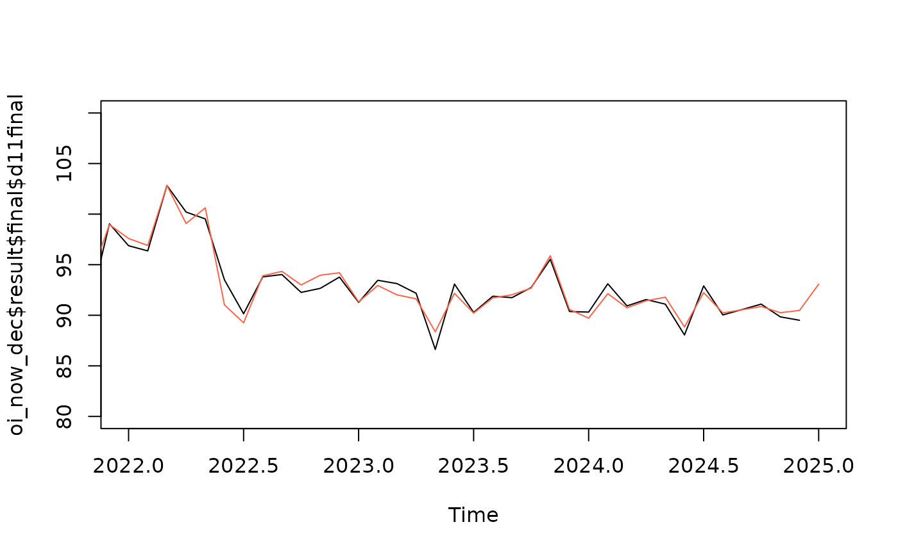
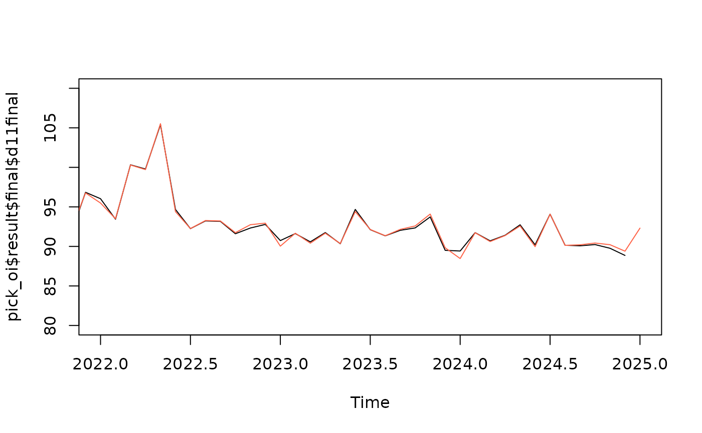
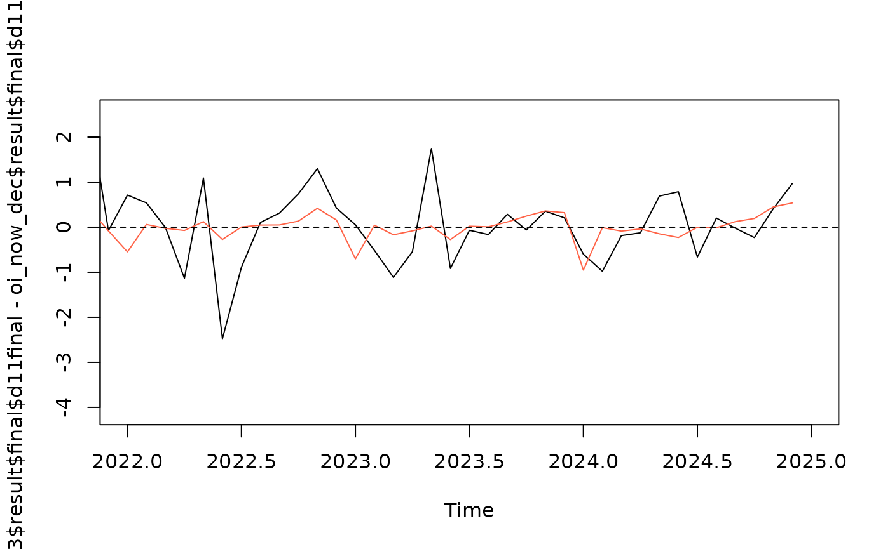

# What is pickmodel?

## What is pickmdl?

Pre-adjustment and forecasting with a sARIMA model is of central
importance to the x13-metholdogy, as heterogenous calendar effects and
effects of outliers need to be taken into account before seasonal
components and trend can be calculated with the filter based methods in
x13. In Jdemetra and rjd3, the procedure for selecting an sARIMA model
is the automodell procedure. The pickmdl approach differs from this
automodel approach by restricting the model choiche to an ordered list
of five robust models. The pickmdl selection procedure selects the first
model on the list that fulfills three pre-defined criteria.

The five sARIMA models on the pickmdl list are:
``` math
\begin{aligned}
(0,1,1)(0,1,1)_s  \\
(0,1,2)(0,1,1)_s \\
(2,1,0)(0,1,1)_s \\
(0,2,2)(0,1,1)_s \\
(2,1,2)(0,1,1)_s
\end{aligned}
```
The tree pre-defined criteria are:

1.  The absolute average percentage error of the extrapolated values
    within the last three years of data is less than 15 percent
2.  The p-value associated with the fitted model’s Ljung-Box Q-statistic
    test of the lack of correlation in the model’s residuals must be
    greater than 5 percent
3.  There are no signs of overdifferencing. There is an indication of
    overdifferencing if the sum of the non-seasonal MA parameter
    estimates (for models with at least one non-seasonal difference) is
    greater than 0.9.

## Why use pickmdl?

By restricting the model choiche to an ordered list of five models, the
pickmdl approach prioritizes model stability. The pickmdl choiche may
not find the optimal fitted model, but one or more models on the list
will often be of acceptable quality. This may lead to less future
revisions of seasonally adjusted data, as the pickmdl approach tends to
select the same model if this model is of acceptable quality. The search
for the model with the optimal fit, on the other and, may introduce
model change when there are only minor improvements to the model fit.

Let us illustrate this point with an artifical example where we use the
Norwegian retail index for nace 47.6 Retail sale of cultural and
recreation goods. In accordance with the best practice defined in ESS
Guideluines on seasonal adjustment, model identification should be done
once a year, and the sARIMA model should be kept according to the chosen
refreshment policy . Let us say that model identification is done in
January based on data until the preceeding December. Through the year,
the model is kept the same in accordance with the Outliers refreshment
policy.

At the moment of model selection in in january 2024, the model selected
by the automodel approach is the (0,0,1)(0,1,1) model, which will be
used throughout the year of 2024. In january 2025, the selected model
will be (1,0,0)(0,1,1), which will be used throughout 2025. In the
figure below we compare We see that the change of models introduces
revision

With the pickmdl approach, the model restriction leads to the selection
of the third model on the list (2,1,0)(0,1,1) in both years. As there is
no model choiche, there will be less revision


